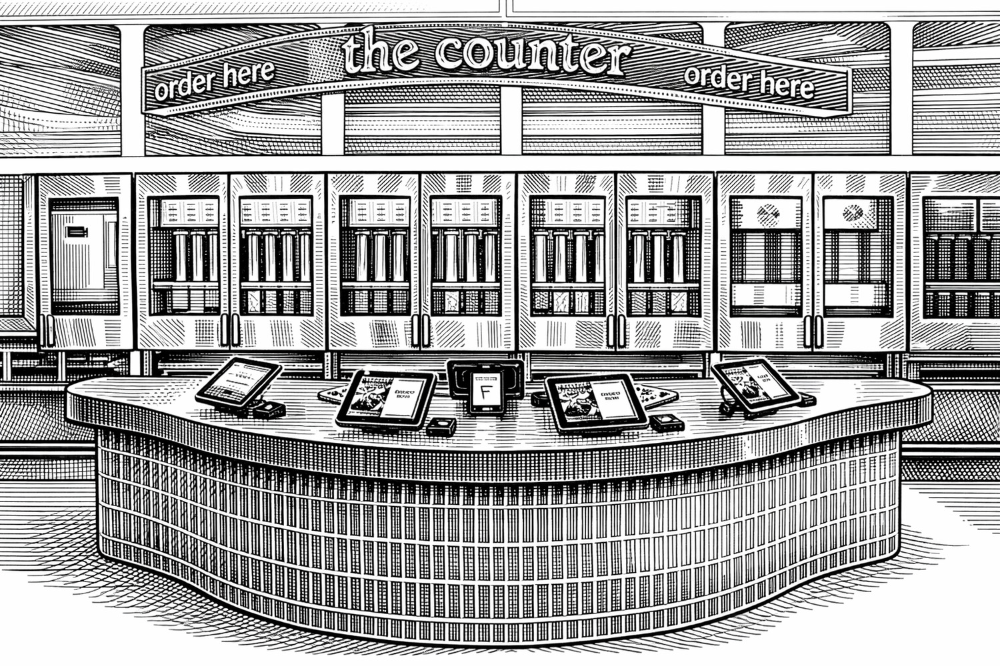

Perhaps you are aware of the popular fast-casual salad shop called Sweetgreen.
They're a semi-iconic brand here in Boston, and I've eaten a *metric shit ton*
of their salads. They're delicious!

Yesterday, I walked into a Sweetgreen here in my town in the Boston suburbs---a
location I'd never been in and quite honestly didn't know was there---and I was
shocked by what I saw. Instead of a counter with several friendly employees
behind it making salads to order, I saw iPad ordering tablets and two guys
silently packing bowls. *Silently*.

Moreover, it seemed like all they were doing was putting dressing on these
salads. Where were they coming from? Who was making them? Why weren't they
talking?

Friends, the reverse centaur has come for our salads.

<!--more-->


First, let's get square on the terminology. I'll directly quote Cory Doctorow
here because he's my favorite prolific, activist sci-fi writer to cite:

> In automation theory, a "centaur" is someone who is assisted by some
> automation system (they are a fragile human head being assisted by a tireless
> machine). Therefore, a *reverse* centaur is a person who has been conscripted
> to serve as a peripheral for a machine, a human body surmounted and directed
> by a brute and uncaring head that not only uses them, but uses them *up*.

Read Doctorow's full piece,
[Checking in on the state of Amazon's chickenized reverse-centaurs](https://pluralistic.net/2025/10/23/traveling-salesman-solution/).

I dutifully approached the bank of iPads and placed an order. Admittedly, this
is convenient, and certainly it is accurate. I have selected exactly what I want
and there can be no debate about it. Still, there's something so weirdly
*antiseptic* about standing five feet from a person making the stuff you're
buying while you tap away on a screen. Our technology erects *invisible walls*
between us sometimes, and once you notice them you can't un-notice them.

As I stood waiting for my order and observing, as I do, I realized what was
happening here. This made the news years ago, so my apologies if you already
knew about this (and in which case, you may stop reading now unless you're here
for the scathing editorialization). One of the guys grabbed an empty bowl, took
it to a counter where a smaller iPad was hovering at eye level.

He glanced at it and placed the bowl onto a little holder and pressed a button.
The bowl was whisked away on a conveyor belt. It made a journey under a whole
bank of stainless steel refrigerators, each containing four clear glass tubes,
each tube filled with a familiar salad ingredient.

I watched as the ingredients in some of the tubes descended slightly,
mechanically, precisely, as their contents were dispensed into bowls below. It's
a *fucking salad machine*! I was honestly amazed. *This is brilliant*, I
thought.

Sweetgreen calls it their "Infinite Kitchen." Great name.

As I stood there, agape, contemplating this *salad robot* in front of me, many
thoughts coalesced in my feeble human brain. I will attempt to enumerate those
for you now.

First of all, wow, it's a salad robot. I can't overstate how impressive this
thing is. Here, go watch the video embedded in this [article in "QSR"][qsr] and
then come back. It rotates the bowls, for god's sake.

[qsr]: https://www.qsrmagazine.com/growth/finance/sweetgreens-automated-infinite-kitchen-readies-for-a-step-up-in-2025/

I love that they decided to make it part of the store experience; there's no
other reason to put glass doors on the things, and have glass cylinders inside.
It's so that we (the customers) can watch it work. It's impressive, it's
futuristic.

At the same time, it felt icky.



This Infinite Kitchen gadget sits on a spectrum that runs from full-centaur to
full-reverse-centaur and I'm grappling with what that even means. On the
full-centaur side is a robot vacuum. You just turn it on and it essentially
performs a menial job for you with little oversight. It is entirely under your
command and control and all of the benefits of the automation accrue to you.

On the full-reverse-centaur side is the Amazon delivery driver, as Doctorow
describes in his many posts. An app tells them where to drive, what packages to
drop, and punishes them if it is detected that they are *singing* (this is a true
story). The human is simply doing the things that the machine cannot, and is
also under the machine's control in very real ways.
